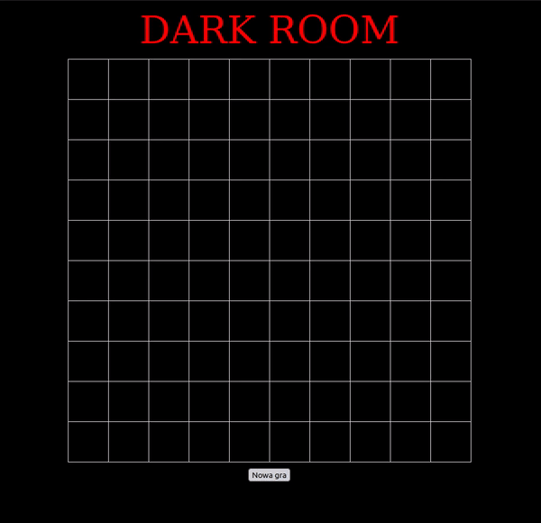

# UNI-WWW-Application-Programming

This repository contains 10 completed exercise sheets from **"WWW application programming"** course from University of Wrocław.  

This course was designed to teach us variety of WWW languages, like: HTML, JS, CSS, PHP, jQuery and SQLite database integrations.  

Below you can find my _cherry-picks_ - the exercises/projects that are worth mentioning:  
- [zadanie_09.html - Calculator](https://github.com/tTargiel/UNI-WWW-Application-Programming/blob/main/Lista%2002/zadanie_09.html)  
  

- [zadanie_06.html - Coronavirus game](https://github.com/tTargiel/UNI-WWW-Application-Programming/blob/main/Lista%2004/zadanie_06.html)  
  

- [zadanie_07.html - Dark Room randomized game](https://github.com/tTargiel/UNI-WWW-Application-Programming/blob/main/Lista%2004/zadanie_06.html)  
  

- [zadanie_06.html - Interactive list of students](https://github.com/tTargiel/UNI-WWW-Application-Programming/blob/main/Lista%2005/zadanie_06.html)  
  

- [zadanie_05.html - Disappearing beans game](https://github.com/tTargiel/UNI-WWW-Application-Programming/blob/main/Lista%2006/zadanie_05.html)  
  

- [zadanie_03.html - Puzzle game](https://github.com/tTargiel/UNI-WWW-Application-Programming/blob/main/Lista%2007/zadanie_03.html)  
  

- [zadanie_05.html - Hanoi game](https://github.com/tTargiel/UNI-WWW-Application-Programming/blob/main/Lista%2007/zadanie_05.html)  
  

- [index.php - Interactive list of students in PHP](https://github.com/tTargiel/UNI-WWW-Application-Programming/blob/main/Lista%2009/studenci/index.php)  
  

- [logix.html - Logix maths game](https://github.com/tTargiel/UNI-WWW-Application-Programming/blob/main/Lista%2010/logix/logix.html)  
  

- [snake.html - Snake game](https://github.com/tTargiel/UNI-WWW-Application-Programming/blob/main/Lista%2010/snake/snake.html)  
  

- [index.php - Daily planner](https://github.com/tTargiel/UNI-WWW-Application-Programming/blob/main/Lista%2010/terminarz/index.php)  
  